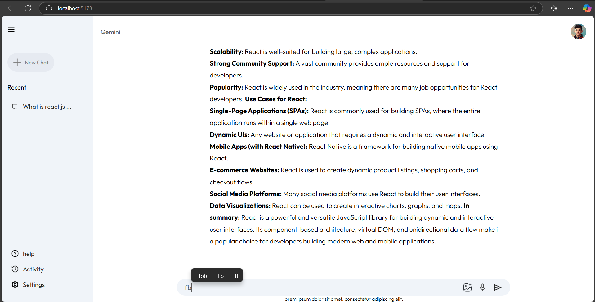

# Gemini Clone

This project is a clone of the Gemini application built using React and Vite. It features a sidebar for navigation and a main content area for displaying results.

## Table of Contents

- [Installation](#installation)
- [Usage](#usage)
- [Project Structure](#project-structure)
- [Screenshots](#screenshots)
- [License](#license)

## Installation

1. Clone the repository:

   ```sh
   git clone https://github.com/rohitshimpi737/google_gemini_clone.git
   cd gemini-clone
   ```

2. Install the dependencies:

   ```sh
   npm install
   ```

3. Start the development server:
   ```sh
   npm run dev
   ```

## Usage

Open your browser and navigate to `http://localhost:5173` to see the application in action.

## Project Structure

- [App.jsx](http://_vscodecontentref_/1): Main application component.
- [Sidebar.jsx](http://_vscodecontentref_/2): Sidebar component.
- [Main.jsx](http://_vscodecontentref_/3): Main content component.
- [context.jsx](http://_vscodecontentref_/4): Context provider for managing state.
- [gemini.js](http://_vscodecontentref_/5): Configuration for Google Generative AI.
- [assets.js](http://_vscodecontentref_/6): Asset imports.

## Screenshots


C:\Projects\MERN\Google Gemini\google_gemini_clone\src\assets\image.png
